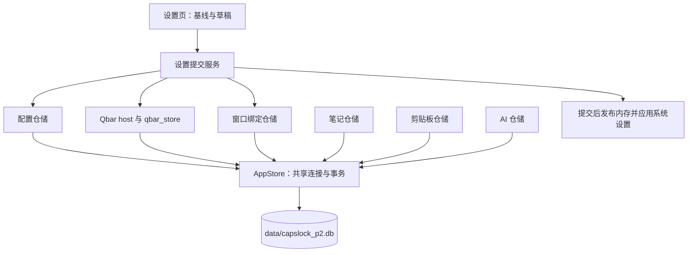

# 统一设置保存与单一用户数据库设计

日期：2026-10-06
状态：2026-10-07 已创建主库并完成本机数据的手动迁移；AHK 语法校验通过（退出码 0，无警告）。未启动应用或执行测试。

## 1. 设计结论

应用配置和用户数据统一到安装目录下的 `data/capslock_p2.db`。设置页中的编辑、新增、删除和窗口绑定全部暂存，点击右上角“保存”时通过一个 SQLite 事务提交。

```text
<安装目录>/
  data/
    capslock_p2.db              唯一活动的用户数据主库
    qbar-notes/media/           保留现有笔记图片目录
    backups/                   新主库的备份
  resources/
    dictionary.db              安装包提供的只读词典资源
```

旧 INI 和四个旧库仅用于这次手动迁移，原文件保留；迁移不是应用功能。成功迁移后，正常运行不打开、不监视、不回写旧来源，也不提供兼容读取、双写或故障回退。主库异常时停止初始化并报告问题。

`qbar_store.ahk` 继续负责 Qbar 持久化，但使用主库中的 Qbar 表，不再创建或打开 `qbar.db`。笔记、剪贴板、AI 仓储同样接入主库。

`resources/dictionary.db` 属于需要随安装包升级的只读资源，保留独立；Everything 索引由 Everything 进程管理，保留现有布局。图片继续存文件。这里的“单库”指一个活动的应用用户数据库，WAL/SHM、媒体和备份不构成第二个配置来源。

为控制改造范围，采用以下约束：

- 保留现有业务表、主键、时间格式和读取接口，避免为合库附带大范围改名与数据转换。
- 设置保存期间短暂锁定编辑，一次只处理一个请求；成功后直接接收规范化快照。
- 使用一个共享连接和明确的事务上下文；业务队列复用现有实现，不新增通用任务框架。
- 通用默认值和用户覆盖分别存入 `cfg_defaults`、`cfg_values`；运行时只从主库读取，不回退到代码、INI 或其他数据库。可信默认值只用于显式创建/结构升级时事务性写入默认表，升级可更新默认值但不得覆盖用户覆盖。
- Everything 等工具私有设置由各自插件 schema 提供可信默认值，并存入同一主库中的 `plugin_settings`；不得再映射为通用 Qbar 配置项。
- 一次性迁移只接受当前 0.3.0 使用的数据格式，不实现更早版本的兼容链。

## 2. 当前存储与改造范围

| 数据域 | 运行时位置与本次手动迁移来源 | 负责模块 |
| --- | --- | --- |
| 通用、AI、翻译设置、全局快捷键、热字符串 | 主库 `cfg_defaults`、`cfg_values`、`cfg_secrets` 等表；本次已手动导入旧 `capslock_p2.ini` | [config.ahk](../lib/app/config.ahk) |
| 应用快捷键配置 | 主库 `cfg_hotkey_scopes`、`cfg_key_overrides`、`cfg_custom_hotkeys`；本次已手动导入用户 INI 中的 `KeyProfile:*` 段 | [appProfiles.ahk](../lib/input/appProfiles.ahk) |
| 窗口绑定 | 主库 `cfg_window_bindings`、`cfg_window_targets`；本次已手动导入窗口绑定 INI | [windows.ahk](../lib/features/windows.ahk) |
| Qbar 插件、命令、别名、设置、历史、频率 | 主库中的 Qbar 表；本次已从 `data/qbar/qbar.db` 导入 | [qbar_store.ahk](../lib/features/qbar/qbar_store.ahk) |
| 笔记、标签、资源引用 | 主库中的笔记表；本次已从 `data/qbar-notes/qbar-notes.db` 导入，媒体继续位于 `data/qbar-notes/media` | [qbar_notes_store.ahk](../lib/features/qbar/qbar_notes_store.ahk) |
| 剪贴板历史、载荷、缩略图 | 主库中的剪贴板表；本次已从 `data/clipboard-history/clipboard-history.db` 导入 | [clipboard_store.ahk](../lib/features/clipboard/clipboard_store.ahk) |
| AI 会话与问答轮次 | 主库中的 AI 表；本次已从 `data/ai-chat/ai-chat.db` 导入 | [aiChat_store.ahk](../lib/features/aiChat_store.ahk) |

改造前，普通设置与应用配置已有草稿，但工具新增/删除和窗口选择仍会即时提交；设置保存还会先写 INI 再写 Qbar 数据库，存在部分成功的风险。当前实现已将这些编辑纳入页面草稿，并在右上角统一保存。

“外部配置已变化”的一项原因是即时提交后推送完整快照，页面有草稿便拒收，即使更新来自本页面。“保存期间的新修改仍未保存”的一项原因是完整插件对象包含规范化结果和展示元数据，直接比较会产生假差异。

单库统一配置域的事务边界；草稿、快照和来源标识解决页面状态问题，两者共同构成当前实现。

## 3. 统一的设置交互

### 3.1 暂存、确认、保存、取消

| 操作 | 页面行为 | 持久化时机 |
| --- | --- | --- |
| 普通输入、开关、下拉选项 | 更新草稿 | 右上角保存 |
| 快捷键录制、映射、热字符串、恢复继承 | 更新草稿 | 右上角保存 |
| 应用配置新增、删除、启停 | 更新草稿 | 右上角保存 |
| 工具名称、启用状态、别名、私有设置 | 弹窗“确认”写回草稿 | 右上角保存 |
| 新增搜索或快捷命令工具 | 弹窗“确认”加入草稿列表 | 右上角保存 |
| 删除工具 | 确认后从草稿列表移除 | 右上角保存 |
| 选择窗口或应用、修改绑定模式、清除绑定 | 选择器返回候选，更新草稿 | 右上角保存 |
| 页面取消或确认放弃编辑 | 丢弃草稿，重新读取已保存状态 | 不写入 |

弹窗“取消”丢弃该弹窗尚未确认的编辑。页面“取消”丢弃全部未保存编辑，包含已在弹窗中确认的内容。工具确认时不写数据库、不发布注册表、不推送设置快照。

只有存在有效变化时启用“保存”。保存期间锁定设置输入、录制、新增、删除、弹窗确认、取消和关闭，显示“保存中…”。校验/事务失败则保留草稿、解除锁定；成功则以回执中的实际已保存配置同时替换基线和草稿。

保存期间不接收新编辑，因此不需要维护多份提交快照或逐字段合并迟到回执，也不再使用“保存期间的新修改仍未保存”作为正常流程提示。

关闭有草稿的设置页时，复用 `AppDialog` 确认是否放弃；选择继续编辑后由右上角保存。无需增加独立的“保存并关闭”路径。

通信超时后保留草稿并禁用继续保存，重新加载应用确认已保存状态，不自动重发请求或再次创建对象。

### 3.2 新工具在统一保存时创建

工具弹窗确认只向页面草稿加入带 `draftId` 的临时记录，不向宿主分配正式身份，也不访问数据库。临时身份只用于编辑，不能执行或关联历史/统计。

统一保存时，宿主校验允许创建的类型，按可信定义生成稳定的 pluginId/commandId，和其他修改在同一事务中写入。保存回执采用主库的最终身份。新增后删除直接抵消；成功结果不明确时必须重新读取主库，不自动再次创建。已有工具重命名或修改别名不改变身份，删除沿用退役语义，保留历史和统计。应用配置继续由原生程序选择返回未持久化候选。


### 3.3 窗口选择与设置会话

窗口选择器返回目标描述及宿主生成的 `selectionToken`。宿主在内存中保存令牌关联的 HWND 和进程身份，保存前重新检查，拒绝窗口已关闭或句柄被重用的候选。页面不能仅提交任意 HWND 来设置绑定。

数据库保存槽位、模式、应用路径和窗口目标描述，不保存 HWND/PID。同一运行期间使用已验证的内存句柄；重启后沿用现有路径和窗口类查找逻辑。多个窗口的描述相同时，只能按现有规则恢复匹配，不承诺恢复原进程中的精确实例。

编辑会话在显式放弃、重新载入、页面销毁或进程结束时失效。面板隐藏、失焦及打开文件选择器只改变可见性，不自行销毁草稿或会话。重新显示时，同一配置修订号不会产生外部变化提示。

### 3.4 统一保存的边界

设置页中的全部配置变更使用统一保存。发送 AI 问题、保存笔记、收藏剪贴板等功能操作仍按各自交互持久化。

设置页外的直接操作，例如快捷键绑定当前窗口、调节鼠标速度或托盘设置切换，继续即时执行，但走同一配置提交服务，更新设置修订号。它们不调用旧 INI 写入方法。

聊天、笔记、剪贴板采集、使用频率和首次使用标记不改变设置修订号。窗口自动发现、HWND 更新也只刷新内存；用户绑定意图未变时，不写设置修订号。

## 4. 模块与事务边界



| 模块 | 最终职责 |
| --- | --- |
| `lib/app/store.ahk` | 唯一主库路径、连接、全库 schema、初始化/结构升级、事务、备份、关闭 |
| 新增 `lib/app/settings_store.ahk` | 普通配置、密钥、快捷键范围、映射和热字符串 |
| `lib/app/config.ahk` | schema、从数据库加载默认值/覆盖、生效配置合并、类型访问与校验 |
| `lib/features/settings.ahk` | 面板生命周期、消息路由和辅助请求 |
| `lib/features/settings/settings_editor.ahk` | 单一基线、完整草稿校验、统一提交及最终快照 |
| `lib/features/windows.ahk` | 窗口绑定表读写、窗口动作与目标解析 |
| `qbar_plugin_host.ahk` | 插件校验、候选构建、执行白名单 |
| `qbar_store.ahk` | Qbar 表的唯一业务持久化接口 |
| 现有笔记、剪贴板、AI store | 各自业务表读写，借用共享连接 |

保留常用 `ConfigRead()`、类型访问、profile 继承等接口，不为存储改造重写上层业务。不保留旧文件导入模块；默认值与字段规则在 schema 中统一声明，建库/明确版本升级时写入数据库，运行时不读取 INI 文件。功能仓储不得自行开关共享连接、改 PRAGMA 或管理全库版本；设置服务也不得绕过仓储直接写业务表。

数据库的类型值在配置服务中集中解码，保留现有读取接口的返回约定；布尔等 JSON/COM 包装必须先转换为纯 AHK 值，避免包装对象流入数值或 Win32 参数。保留接口约定不意味着保留旧存储读取路径。

### 4.1 单连接、短事务

复用 `resources/SQLite3.dll` 和现有 `CSQLite` prepared statement 接口。正常运行一个主库连接；只读词典连接与迁移期间的来源连接不属于第二个用户主库。

```sql
PRAGMA foreign_keys = ON;
PRAGMA journal_mode = WAL;
PRAGMA synchronous = FULL;
PRAGMA busy_timeout = 2000;
```

初始化必须检查返回码与实际 journal mode。普通打开使用 `OpenDB(path, "W", false)`，禁止库不存在时隐式创建。所有 prepared statement 在 `finally` 中 finalize，关闭连接失败不能报告为已经安全关闭。

AppStore 提供同步的 `AppStoreTransaction(owner, callback)`，明确管理 BEGIN/COMMIT/ROLLBACK 和事务上下文。使用短 `Critical` 区域覆盖数据库写入及纯内存发布；不得在其中等待网络、打开弹窗、调用 WebView 或执行系统设置副作用。

各仓储的批量写入方法接收同一事务上下文，不能另开或提交事务。独立业务操作由最外层服务开启事务；嵌套事务和不同 owner 的重入必须拒绝或延期，不以 savepoint 隐藏归属问题。非事务拥有者也不能借共享连接读取未提交候选。

COMMIT 失败要确认事务状态并尝试回滚；回滚也失败时将连接标为不可用，停止后续写入并记录错误，不能继续复用状态未知的连接。候选构建必须是纯操作，不原地改动已发布的配置或注册表。

不新增通用持久化任务队列。剪贴板复用现有采集队列，AI 复用检查点节流；事务忙时由对应功能保留待处理数据、在回调外通过现有定时器有界重试。队列上限和失败处理由业务模块负责，不能无限缓存。

只有配置生效后才调用系统和页面接口；后台清理分批提交，不能长期阻塞设置保存。

## 5. 数据模型：新增配置表，保留业务表

### 5.1 全库元数据

使用 `PRAGMA application_id` 标识本应用主库，`PRAGMA user_version` 作为唯一 schema 版本。首次创建写入标识；普通打开先校验身份和版本。所有功能的结构升级由 AppStore 按全局顺序执行，升级前备份，更高版本则停止打开。

`app_meta(key PRIMARY KEY, value)` 保存数据库身份、创建时间、单个 `settings_revision` 和完成导入的简短来源清单。`app_state(key PRIMARY KEY, value_json)` 保存首次使用等内部状态。

`settings_revision` 只在配置发生有效变化时加一；不为每条配置记录再添加独立修订列。来源清单记录名称、版本、数量和导入时间即可，不另建迁移流程表、请求表或审计事件库。诊断问题写日志，避免复制用户正文。

### 5.2 新增配置表

| 表 | 建议字段与约束 |
| --- | --- |
| `cfg_defaults` | `(scope, key) PRIMARY KEY, value_json`；完整默认配置，值为 JSON 标量 |
| `cfg_values` | `(scope, key) PRIMARY KEY, value_json`；仅存 schema 允许且不同于默认值的用户覆盖项 |
| `cfg_secrets` | `(scope, key) PRIMARY KEY, protected_blob`；DPAPI 密钥覆盖项 |
| `cfg_hotkey_scopes` | `id PRIMARY KEY, kind, exe_path, normalized_path UNIQUE, display_name, enabled` |
| `cfg_key_overrides` | `(scope_id, trigger) PRIMARY KEY, action_key, args_json`；scope 外键 |
| `cfg_custom_hotkeys` | `(scope_id, trigger) PRIMARY KEY, action_kind, action_value`；scope 外键 |
| `cfg_hotstrings` | `trigger PRIMARY KEY, replacement_text` |
| `cfg_window_bindings` | `slot PRIMARY KEY CHECK 1..10, mode, application_path` |
| `cfg_window_targets` | `(slot, ordinal) PRIMARY KEY, exe_path, exe_name, window_class`；slot 外键 |

`cfg_hotkey_scopes.kind` 区分 global/application。固定 `global` 记录不可删除且始终启用，路径为空；应用范围要求有效且唯一的规范化 EXE 路径。路径规范化复用 `AppProfileNormalizePath()`，不依赖 SQLite 的 ASCII `NOCASE` 来实现 Windows 路径比较。

覆盖记录缺失表示继承；显式禁用、保留原生、发送内容分别使用已存在的动作语义，不能用空字符串混淆删除和禁用。bool、kind、mode、序号、关联添加 CHECK/FOREIGN KEY 约束，复杂字段仍由宿主 schema 校验。

删除应用范围时级联清除其快捷键覆盖；删除绑定槽位时级联清除目标。未绑定用槽位记录缺失表达，mode 只允许窗口、窗口组、应用三种；应用模式必须有合法路径，窗口模式必须有目标。窗口目标保留当前解析器使用的 EXE 名称和路径，不能把旧数据中的单个文件名伪装为完整路径。

`action_key` 沿用当前 `keyFunc_*` 动作键，不为合库再引入一套动作命名。读取、导入和保存时解析为代码中登记的动作与允许参数，只从已注册动作目录取函数引用；现有仅检查名称前缀的路径不能直接当作完整白名单。自定义动作需通过可信代码入口明确注册。存储的是配置数据，数据库不能提供 AHK 源码或任意函数调用。

动作目录复用现有 `CustomHotkeyBuiltinActions()` 及默认映射中的可信定义，补齐明确的注册入口，不再增加第二套 ID 命名。`cfg_defaults` 与 `cfg_values.scope/key` 沿用当前配置 schema 的字段身份；只有工具私有项和内部状态按其职责迁移。默认项缺失属于初始化或升级失败，不能由运行代码静默补值。版本升级事务性同步可信默认项，只修改 `cfg_defaults`，不重写 `cfg_values`。

旧的合法 `keyFunc_*(参数)` 在导入时拆成动作键与 `args_json`，由该动作的参数规则验证；无参数动作使用空数组。调用时把参数传给已登记函数引用，不拼接代码或求值表达式。不存在或未登记的动作保留配置数据并停用，提示重新选择。

热字符串和多行提示词保存逻辑文本，不使用 INI 单行转义。输入参数、Send 数据、程序路径与工具命令按各自现有校验规则处理。

### 5.3 现有业务表直接接入主库

核对当前 schema 后，四个库的业务表没有重名，合库无需统一改表名。按模块保留所有权，并在 schema 模块登记表归属；后续新增表必须使用域前缀，避免名称冲突。

| 所属模块 | 保留的业务表 |
| --- | --- |
| Qbar | `plugin_definitions, plugins, commands, command_aliases, plugin_settings, plugin_state, command_usage, command_history` |
| 笔记 | `notes, tags, note_tags, note_assets` |
| 剪贴板 | `clipboard_items, clipboard_payloads, clipboard_thumbnails` |
| AI | `ai_chat_sessions, ai_chat_turns` |

原 `schema_meta`、`history_meta` 只由导入器读取版本；除版本外若存在有效业务元数据，需要列明并转入 `app_meta/app_state`，不能整表丢弃。运行时不再保留独立库的升级版本控制。

保留原主键、外键、索引、AUTOINCREMENT 序列和业务时间字段。特别是当前 AI 用本地 `yyyyMMddHHmmss`，笔记用 UTC `yyyyMMddHHmmss`，Qbar 用 UTC ISO 文本；它们不是统一的 epoch 秒。此次迁移原样保留，不推算历史时区、不转换成 UTC 毫秒。新库元数据统一使用 UTC ISO 时间即可。

Qbar 定义表是元数据缓存，可信定义/handler 仍来自代码及经校验的 manifest。别名、历史和统计继续按稳定 ID 关联，别名冲突保留多候选；逐字符搜索只读内存注册表。

### 5.4 工具配置归属

Everything 的 `esMaxResults` 移到 `builtin.everything` 的 `settingsSchema` 和 `plugin_settings`，保持默认 50、范围 1–500。导入时把当前 INI 值合并到该工具设置；运行时读取已发布插件配置，移除 `[Qbar]` 和独立 `toolSettings` 通道。该值归工具 schema 的可信默认值，不写入 `cfg_defaults` 或通用 Qbar 配置域。

剪贴板记录策略继续归 `builtin.clipboard`。AI endpoint、model、密钥、公共提示词归共享配置；`builtin.ai` 只拥有入口相关配置。同一选项只有一个持久化位置。

## 6. 代码默认值与密钥

通用默认值和大规模快捷键映射由受版本控制的可信 seed 声明，在建库或明确 schema 升级时写入 `cfg_defaults`；插件默认值由各自可信 schema 写入插件设置。普通运行只加载数据库默认项并叠加 `cfg_values` 覆盖，默认记录缺失或损坏时停止初始化，不从代码参数或文件兜底。恢复默认即删除覆盖记录；更新应用版本时可调整默认项，既有覆盖保持不变。

首次使用标记沿用 `Global.usageShown`，存储在主库配置表。旧默认 INI、示例 INI 和个人 INI 均保留；默认 INI 在本次手动迁移中用于核对可信 seed，示例 INI 不含运行配置、不参与导入，二者都不是发布资源。

密钥存到 `cfg_secrets`，使用 Windows `CryptProtectData/CryptUnprotectData` 当前用户范围保护，与其他设置在同一事务提交。页面只接收是否已设置，提交 `keep/set/clear` 意图；未修改不写入，清除要明确表达，连接检查可消费未保存草稿但不持久化。

DPAPI 密文可在原 Windows 用户配置环境中解密；换电脑或用户后不能保证解密，即使显示用户名相同。解密失败保留原密文并停止配置加载，提示保留数据库、查看日志；不把无法读取的凭据当成空值。此方案不是整库加密，用户正文仍为普通 SQLite 内容；不增加 SQLCipher 等新引擎。

## 7. 当前保存协议与原子提交

此节按 [设置页简化设计](2026-10-07-settings-simplification-design.md) 更新，替代旧的分域 dirty、三方冲突及工具提前准备协议。

### 7.1 单一模型与消息

页面只维护 schema、base、draft 和页面 status；sessionId/revision/requestId 用于编辑会话和请求匹配。只比较可编辑配置，工具 schema、状态与统计不参与 dirty。普通字段与工具字段共用控件，专用编辑器仍读写同一份 draft。

页面通过 postMessage 发送请求，宿主通过 PostWebMessageAsJson 返回 `{type, payload}`；页面只有一个消息入口，实现位于闭包内。保存与密钥操作共用请求表，拒绝响应类型、会话或 ID 不匹配的结果。

### 7.2 统一保存

1. 提交完整的可编辑 draft，页面锁定编辑、取消和关闭。
2. 宿主校验编辑会话、递增 requestId 及基线 revision，规范化并校验各域，计算与宿主基线的差异。
3. 在一次 AppStore 写事务内比较 settings_revision；不同则整个保存不提交，保留草稿并要求重新载入。
4. 通过对应仓储只写变化的配置/对象，工具变化时构建注册表候选；有实际差异才增加一次 revision。
5. 提交后发布运行候选、应用配置、重新读取主库并返回完整公开快照。
6. 页面成功时替换 base 和 draft；失败保留 draft。已提交后的应用失败明确报告已保存。

保存结果缺失、无法载入或超过 30 秒未收到时禁用编辑并要求重新加载确认，禁止自动重发或重复创建。宿主拒绝重复及更旧的保存 requestId，不增加请求日志表或消息重试队列。

### 7.3 设置版本与辅助状态

只用一个 settings_revision，其他入口修改不同项也会导致本次保存冲突。所有用户配置写入必须在事务内增加此版本，包括托盘选项、鼠标速度及窗口绑定。首次使用标记、内容/历史/统计写入和纯窗口句柄刷新不增加版本；窗口句柄刷新只改运行内存。

同会话重复显示保留草稿。取消、关闭或导航后清理会话、选择、录制和连接检查；重新打开读取最新主库。

密钥基线只公开是否已设置；draft 使用 keep/set/clear，明文只在宿主和用户明确查看/输入时可用。Tab 替换与自定义快捷键按当前可见行重建，保存前拒绝重复、不完整行。新工具仅在保存时创建，窗口令牌继续由宿主持有并校验。


## 8. 首次初始化与本次手动迁移

### 8.1 应用首次初始化

| 状态 | 行为 |
| --- | --- |
| 主库存在且有效 | 禁止隐式创建地打开主库，检查身份、版本和必要表，加载数据库默认值与个人覆盖 |
| 主库存在但无效、不可写或版本过高 | 停止初始化并报告错误，保留文件 |
| 主库不存在，且没有该库的 WAL/SHM/journal 残留 | 在唯一暂存文件中创建全库结构、写入默认配置和插件设置；校验、提交、关闭后无覆盖地发布为主库 |
| 主库缺失但仍有数据库日志 | 停止初始化，避免丢失日志中的已提交数据 |

全新建库的默认配置写入 `cfg_defaults`，插件默认设置写入 `plugin_settings`；两者与结构、身份和版本在同一初始化事务中提交。普通运行只读数据库中的设置，配置缺失或损坏时报告错误，插件无效配置停用对应命令，不从代码静默补值。可信默认声明仅用于建库、明确版本升级和创建新插件。

启动不检测旧 INI 或旧功能数据库，不询问是否迁移，不读取、导入或清理旧文件。配置 schema 升级由 AppStore 管理并先备份；升级不覆盖个人设置。读取配置后如需提权重启，先关闭主库并交接实例锁，避免两个写入实例。

### 8.2 本次手动迁移范围

本次开发环境迁移已经执行，属于数据准备操作，不交付为程序功能。

| 来源 | 格式与处理 |
| --- | --- |
| `capslock_p2-default.ini` | 与受版本控制的可信 seed 逐项核对；161 项通用及快捷键默认值写入 `cfg_defaults` |
| `capslock_p2.ini` | 当前个人设置、快捷键、应用配置、凭据；按现有 codec 解码并写入对应配置表 |
| 窗口绑定 INI | 导入槽位、模式、程序路径与目标描述，不保存已经过期的窗口句柄 |
| `data/qbar/qbar.db` | `schema_meta.schema_version = 1`，导入插件、命令、别名、设置、历史与使用统计 |
| `data/qbar-notes/qbar-notes.db` | `user_version = 2`，导入笔记、标签和附件引用 |
| `data/clipboard-history/clipboard-history.db` | `history_meta.schema_version = 5`，导入记录、原始载荷和缩略图 |
| `data/ai-chat/ai-chat.db` | `user_version = 1`，导入会话及问答轮次 |

示例 INI 不参与导入。Everything 最大结果数归 `builtin.everything` 的插件设置；本机未提供个人覆盖，默认 50 已直接写入 `plugin_settings`，不使用导入标记或运行时转换。

### 8.3 已执行的数据复制与校验

1. 使用 SQLite Backup API 从每个旧库的只读连接获得一致性快照；旧文件不写入，包含 WAL 中已提交的数据。
2. 新建唯一暂存库，采用 DELETE 日志模式，复用应用源码声明的全部结构；配置和四个数据域在同一数据写入事务中导入。
3. 逐行复制原列、主键、外键、业务时间字段和 BLOB，保留自增序列。对配置默认值进行逐项核对，复制的业务表在明确配置转换前逐表计算内容摘要并与快照比较。
4. API 凭据以 UTF-8 字节使用当前 Windows 用户 DPAPI 加密，写入 `cfg_secrets`；逐项解密核对，不输出凭据值。
5. 保留现有 `data/qbar-notes/media`，核对全部附件引用文件存在，不移动、重命名或清理媒体。
6. 检查 `integrity_check`、`foreign_key_check`、记录内容、自增序列、默认项完整性和凭据一致性；提交并关闭后，在同一卷无覆盖地发布 `data/capslock_p2.db`，重新只读打开核对。
7. 保留旧配置、旧库和本地快照。临时迁移工具、快照及详细校验报告位于本地 `temp/`，通过 `.git/info/exclude` 排除，不进入应用或安装包。

主库发布后仍未启动应用；正常启动由共享连接启用 WAL。AI 未完成轮次继续由现有恢复逻辑处理，本次复制不改变问题、回答与历史状态。

### 8.4 手动迁移结果与字段转换

迁移时间：2026-10-07 14:36（Asia/Shanghai）。主库大小：59,604,992 字节。

| 数据 | 主库数量 |
| --- | ---: |
| 默认配置 | 161 |
| 通用个人覆盖（含首次使用状态） | 9 |
| DPAPI 凭据 | 5 |
| 应用快捷键配置 | 1 |
| 快捷键覆盖 / 自定义热键 | 3 / 1 |
| 窗口绑定 / 目标描述 | 4 / 3 |
| Qbar 插件 / 命令 / 别名 | 19 / 19 / 27 |
| Qbar 历史 / 使用统计 | 5 / 9 |
| 笔记 / 标签 / 标签关系 / 附件引用 | 10 / 1 / 2 / 4 |
| 剪贴板记录 / 原始载荷 / 缩略图 | 161 / 161 / 16 |
| AI 会话 / 问答轮次 | 4 / 4 |

配置转换：

- 旧 `Keys.caps_tab=keyFunc_tabScript` 转为当前 `keyFunc_tabHotString`；`press_caps` 和 Chrome 应用的快捷键覆盖已保留。
- `QWeb` 中的 GitHub 别名转为现有声明式 Qbar 命令，使用已注册的 `builtin.run` handler 打开原网址，不存储可执行 AHK 代码。
- `LLMTranslate` 中旧的目标语言/引擎字段由 `TTranslate` 对应设置承接；`TTranslate` 中重复的有道凭据与专用 `TYoudao` 段一致，保留专用段凭据。`TVolcengine.targetLanguage` 的旧文字值由当前统一翻译目标 `zh-CN` 承接。
- 已退役的 `Global.javascriptOriginalReturn`、`Global.loadScript` 不写入有效配置。空的自定义热键表示删除，不创建空记录。
- Qbar 原有稳定 ID、显示名称、别名、启用/删除状态、历史和使用统计保留；可信插件定义缓存及完整默认设置同步到主库。无效的旧插件设置不作为运行时默认值来源。

SQLite 完整性与外键检查、复制内容摘要、自增序列、5 项凭据和 4 个附件引用全部通过。AHK `/validate` 退出码为 0，`#Warn All, StdOut` 无警告。未启动应用，未编写或运行测试；因此这些结果不替代运行中的功能验收。

2026-10-07 启动问题修复：日志显示默认配置完整性校验失败；只读核对确认 161 项默认值全部存在。原因是 `TabHotString` 和 `CustomHotkey` 的默认分类为空，SQLite 不保存空分类记录，旧校验却要求分类必须存在。校验已改为逐项检查声明的默认字段，真正缺失时日志记录具体字段；生效配置仍按 schema 建立空分类。此次修复不修改数据库数据。

## 9. 备份、媒体与性能

### 9.1 安装与备份边界

安装器继续当前用户安装和可写目录布局，显式资源清单不包含 `data/`。覆盖安装和卸载不覆盖或删除用户主库、媒体、备份和旧迁移资料。不可写目录启动时说明原因，不另建 AppData 主库。

升级新主库 schema 前使用 SQLite Backup API 生成一致性备份。实现复用当前 Qbar 已逐步检查返回码的 backup 调用；不能直接把 CSQLite 的 `LoadOrSaveDb()` 当作可靠完整备份接口，它当前含临时文件删除/覆盖和简化的返回码处理，不符合此流程。

完整用户备份包含主库和媒体。运行中备份需暂停媒体写入/清理，通过 Backup API 取得数据库快照并复制引用文件、核对完成；不能只复制正在使用的 .db 文件忽略 WAL。退出程序后可直接备份整个 data 目录。

结构升级不改变媒体时，升级前数据库备份无需再复制全部图片。恢复是针对新主库备份的明确操作，先验证，再在关闭写入和连接后切换；它不回退到旧 INI 或旧 qbar.db。初版不附带新的配置导出格式或通用导入/合并界面。

### 9.2 内容与事务成本

图片继续先完成文件写入、再提交数据库引用；SQLite 无法与文件系统做联合事务。遵循现有资源生命周期和用户授权的清理策略，迁移不增加文件删除行为。

剪贴板 BLOB 和缩略图保持独立表；列表只查元数据，AI 列表不读取全部轮次。容量和保留时间仍按功能计算，不按主库文件总大小清理其他域。

FULL 同步保护保存持久性；通过现有检查点节流、短事务和清理分批控制写入成本，不逐 AI token 提交。配置纯候选构建按变化域执行，避免一般选项保存触发全部索引重建。

空闲维护执行有界 checkpoint；全库 VACUUM 只进入明确维护流程，不放在设置保存或每次捕获中。出现 SQLITE_FULL/IOERR 时回滚、停止相应写入并保留现有数据，不清空内容或重建默认库。

一个连接足以满足当前单实例访问模式。后续只有实际性能证据需要时才增加同一主库的只读连接，不为合库先引入连接池、独立写线程或第二个活动库。

## 10. 实施顺序

| 阶段 | 内容 | 完成条件 |
| --- | --- | --- |
| A | AppStore、全局 schema、新配置表和仓储事务上下文 | 已完成：运行数据仓储借用主库连接 |
| B | 数据库默认值、配置/profile/窗口读取、工具私有设置归属 | 已完成：配置从主库读取，Everything 设置归属插件 schema |
| C | 工具草稿准备、新增/删除、窗口令牌、保存期间锁定和统一回执 | 已完成：设置页改动统一暂存，右上角保存 |
| D | 单次配置事务和现有内容仓储接入 | 已完成：设置域共用一个保存事务；内容域的短事务由共享连接串行执行 |
| E | 全新建库与本机手动迁移 | 已完成：主库已创建并核对；应用无旧来源导入功能 |
| F | 退出旧运行路径、更新说明和安装资源清单 | 已完成：安装包排除配置 INI 与 `data/`，正常运行只打开主库 |

这些阶段在同一改造分支上完成，单库及导入流程完整后才切换正式发布。中间阶段不交付同时写新旧来源的版本。

正常运行路径已切换到主数据库；旧 INI 和旧库仅在本次手动迁移中读取，启动不再访问。README、architecture、packaging 和 AGENTS 已同步存储路径说明；Qbar 的业务持久化边界继续留在 qbar_store.ahk。

## 11. 验收标准

1. 设置页所有编辑、新增、删除和绑定选择先暂存，只有统一保存才生效；保存期间不能产生新草稿。
2. 正常运行唯一用户数据库为 data/capslock_p2.db，无旧 INI/旧库读取、启动迁移或自动清理路径。
3. 一次配置事务覆盖全部配置域；提交失败不改变运行内存，提交后的系统应用问题准确反馈。
4. dirty 只依据可编辑数据；自己的回执不报外部变化，内容写入不增加设置修订号。
5. 新工具的 draftId 不参与执行，正式 ID 在保存时生成；结果不明确时不自动重发创建。工具退役保留历史和统计身份。
6. 窗口句柄只在宿主内存有效；保存时重新验证选择，自动发现不改用户绑定配置。
7. 当前数据迁移保留 ID、原时间值、正文、BLOB、序列、配置和图片关联；按来源版本、完整性、外键、源/目标表行数、自增序列和目标库完整性校验后才发布。媒体不搬动也不清理，原有引用保持不变。
8. 全新建库与既有主库打开分离，普通打开不隐式创建；损坏、残留日志和版本错误停止初始化，不触发旧存储兜底。
9. 备份覆盖 WAL 已提交内容，用户完整备份包含媒体；升级和卸载不覆盖或删除运行数据。

### 11.1 2026-10-07 简化重构之前的审查记录

本节保留故障修复经过；当前实现以第 7 节及设置页简化设计的实施记录为准。

审查覆盖加载、各配置域编辑、弹窗确认/取消、范围切换、窗口选择、统一保存、事务冲突检查、运行配置应用及回执处理。

| 环节 | 修复及约束 |
| --- | --- |
| 加载 | 宿主持有一致的主库基线；同会话重复快照不覆盖草稿；加载失败禁用编辑并给出重新打开提示 |
| Tab 替换/自定义快捷键 | 当前可见行重建草稿；保存前拒绝重复及不完整行；应用覆盖先规范化触发键，不把继承行写成覆盖 |
| 工具 | 确认只暂存；修改列表与删除列表分开；布尔值转换后写库；移除旧即时保存回调和重复准备流程；编辑时不从 schema 默认值补齐缺项 |
| 窗口 | 连续添加累积本次暂存选择；只写改变的槽位；新选择绑定进程身份，在保存时再确认；既有描述不要求对应窗口始终存活；应用模式必须有有效路径 |
| 密钥 | 查看不改变草稿；查看/复制回执绑定原会话；保存/退出清理待处理请求；清除按钮固定显示，无内容时禁用；按钮刷新和固定占位避免持续等待与鼠标误点 |
| 取消/关闭/切换范围 | 统一关闭共享弹窗、停止录制并清理宿主会话；范围切换前检查当前快捷键行；过期异步回复不能切换当前编辑对象 |
| 保存 | 单个活动请求；保存期间禁止编辑；事务内读取当前值完成冲突检查；失败不清草稿，成功采用主库完整快照 |
| 应用与回执 | 已提交后的应用失败明确报告已保存；缺失或无法载入的成功回执要求重新打开；旧回执不能解除新请求的锁定 |

完成 PowerShell AutoHotkey v2 `/ErrorStdOut /validate`（含 `#Warn All, StdOut` 警告收集）、Node `--check` 和 `git diff --check`。AHK/JavaScript 语法检查通过，未发现 AHK 警告或差异空白错误。遵循 AGENTS.md，本次没有编写测试、启动应用或执行运行时保存验收；这些结果只证明静态检查通过，不能替代实际运行验证。

后续加载故障修复：经典脚本中的全局函数声明会与 `window` 上的同名属性共用绑定；给 `window.receiveSnapshot` 赋值为包装回调后，包装回调中再次调用 `receiveSnapshot` 会调用自身。内部快照处理统一改名为 `applySettingsSnapshot`，加载入口和保存回执均明确调用它，避免递归和丢失 `committed` 参数。补充页面异常日志，仅记录阶段、异常类型和源码行列，不记录设置内容或密钥。

旧用户 INI、窗口绑定 INI、默认 INI、示例 INI 和四个旧数据库目前全部保留，不是运行来源。安装包排除配置 INI 与 `data/`，本机准备好的主库也不随安装包发布。

可信 seed 只在创建主库或默认集版本升级时写入数据库；它不参与运行时回退。默认值、个人覆盖及工具私有默认值均已写入主库。源码中不再保留旧文件导入、INI 写入、旧库升级或启动自动删除逻辑。

## 12. 相关文档

- [Qbar 全插件化设计](2026-10-02-qbar-plugin-refactor-design.md)
- [剪贴板历史设计](2026-10-03-clipboard-history-design.md)
- [AI 多会话设计](2026-10-05-ai-chat-multi-session-design.md)
- [架构说明](architecture.md)
- [打包说明](packaging.md)

实施后本方案取代这些文档中独立用户库和运行时 INI 的存储结论。各功能业务流程、执行白名单和稳定身份规则继续适用。
